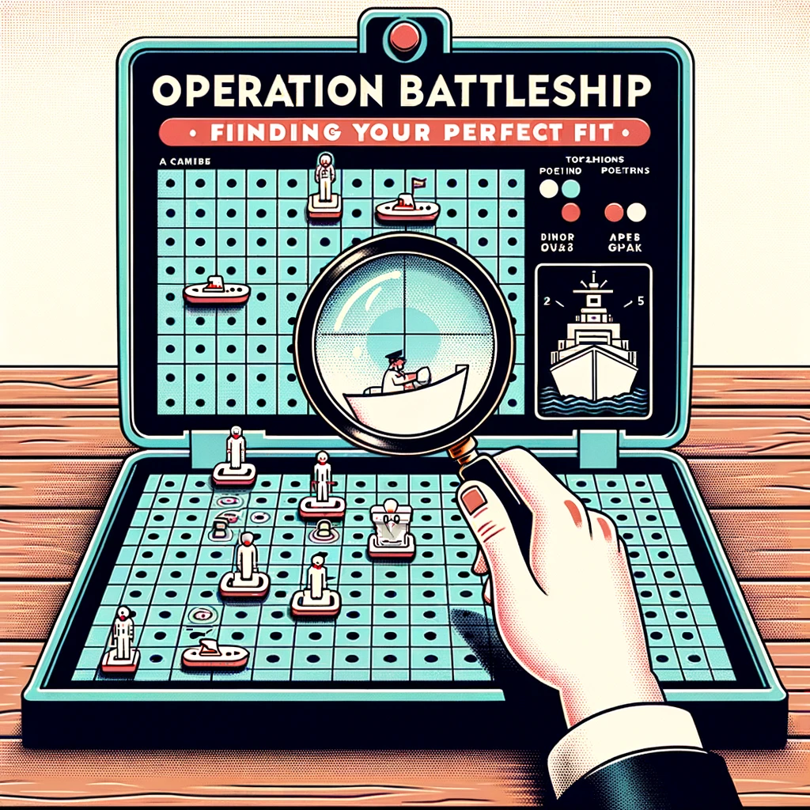

# OperationBattleship

## Vision Statement

In a world where top-tier talent often misses out on the opportunities that match their skills and aspirations, we aim to be the intelligent sonar of the job market. We strive to lift the fog of war, providing a comprehensive, real-time panorama of Product Manager job openings across the U.S. economy. Our platform equips Product Managers with the insights they need to pinpoint roles that not only align with their career goals but also resonate with their values. We are committed to making the job search as efficient, transparent, and rewarding as possible, so that the best in the industry can effortlessly find their perfect fit, driving both individual and organizational excellence.

### Product Pitch Video
Please see this Youtube Video for a little deeper introduction into this project. 

### Additional Product Management Collateral:
For insights into the Product Management activities involved in the creation of this project, check out the [Product Management Documentation](./ProductManagementActivities/readme.md).

First Milestones (Pre-MVP)
- Exploring the data using python and MatPlotLib. 
    We can use basic EDA techniques to uncover the common job titles, companies that post them and other basic details that will inform our decisions for future iterations of the project. This information is found in the EdaProjects Folder of this repo. 
- Exploring the data using Google Looker Studio
    We want to leverage a free, online tool that will automatically refresh new data from our DB and present information about the changing job market. The limited capabilities that are found in Google Looker Studio meet our needs well. Link can be found here.

First MVP
- Users will be able to send an email to [FindMyNextJob@CarawayLabs.com](FindMyNextJob@CarawayLabs.com) and the system will return an email later that will contain a list of recomended jobs for the user to explore. 

### Links to explore:

- Google Project Folder
    A lot of the lab notes and general documentation for this project is contained in the above Google Drive. Take a peek and you will get an understanding of the ways in which I have approached this project. You will be able to see running notes to showcase how I've solved certain problems, executed discovery activities, approached design decisions, and just a general peek into the mad scientist's labratory!

- Project Overview / Business Case
    A short overview of why we've embarked on this journey. If this was a real project that was intended to be commercialized, we would have a much more thorough approach and would have forecasted a financially beneficial ROI. 

- Nomic
    We believe that Job Seekers want multiple ways to explore the available jobs to them. Our MVP is centered around delivering job recomendations using email as a channel. But our interview data and our own experience tells us that is not suffient. We believe there a lot of benefit to be realized by allowing job seekers to explore jobs via a two-dimensional plot. Nomic is a new platform that is easy to use for a developer. Our top concern with this product is that most people don't intuitively know what to do with it. We've observed that it takes a little education and onboarding of new users before people have an "aha! moment with Nomic". But we've found that once people understand what the tool is and how it can be used, they are eager to use this when exploring jobs.  

- System Design
    The design of our system will evolve as we learn more and expand beyond the first iterations. We've started with an end state in mind for our system design. This allows us try to see the big picture when making early decisions. We must balance our need to build small, lean MVPs against the imperitive to have a clear line of sight for the end goal. 

### Future Improvements
These are NOT listed in strict pririty order. These are listed with the intention to showcase possible ways we can drive new value to job seekers. Most often, these will be prioritized using lean experiments that validate this is a real problem faced by our target persona. However, sometimes, I will also choose to build something because I want to go learn a new technology and apply that to this product. I'm fully acknowledging that is NOT the way we do business in the real world. But on the other hand, I recognize that this 

- Further data collected about companies
    1: Creating embeddings from their "About Us"
    2: Create the ability to return jobs from a company's career's page
    3: Build an identity graph to show how human capital has moved among different companies. 
        This will be a great way to 
- Using the LLM to communicate a user's strengths and gaps

### System Information
This application is powered using various technologies. We've deployed using a hybrid cloud approach with some elements on-prem.  
- Our cloud provder is primarily Digital Ocean. RDBMS and microservices are hosted here. 
- Our data pipeline is a collection of python scripts that run locally
- Our RDBMS is PostGres
- Our Vector DB is Pinecone
- Our LLM of choice is ChatGPT 3.5Turbo

### Important Directories and Repositories
This project is split up into a couple different directories within this GitHub Repo and also a couple other repos. 
- Main Repo
    - Data Pipeline
    - Database
    - EDA Projects

- Common Utilities
- Job Recomendation Microservice

With inconsistent use, we've been documenting some TODOs and project plans using GitHubs Project Planning tool. We've used this in loose Kanban style. Please know, this is often NOT up to date and often work is done w/o tracking on the kanban. 
